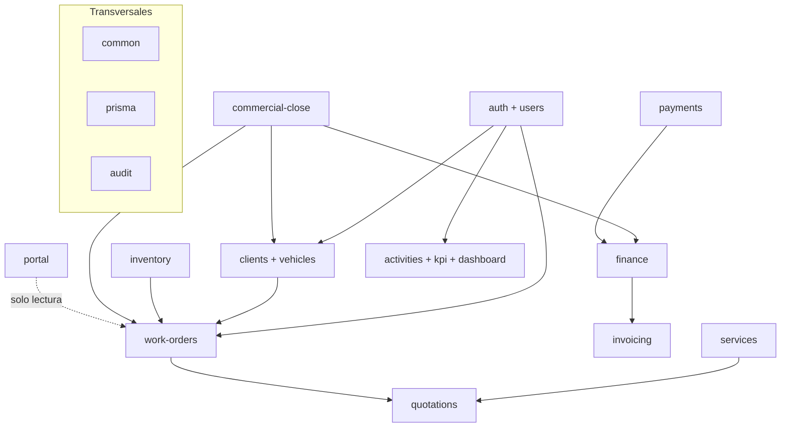
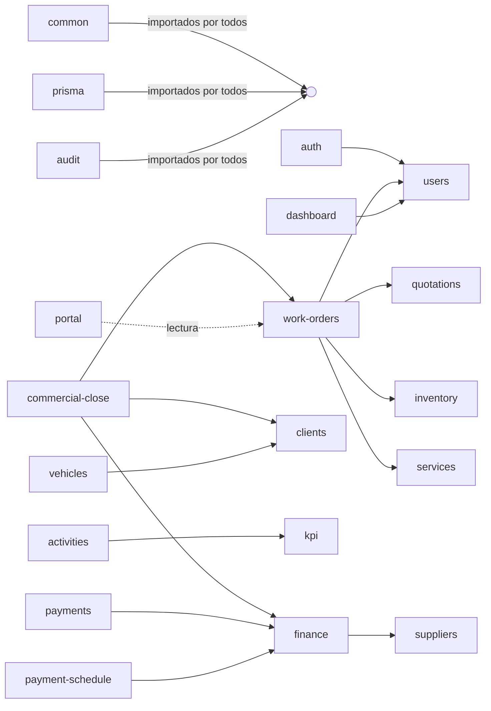
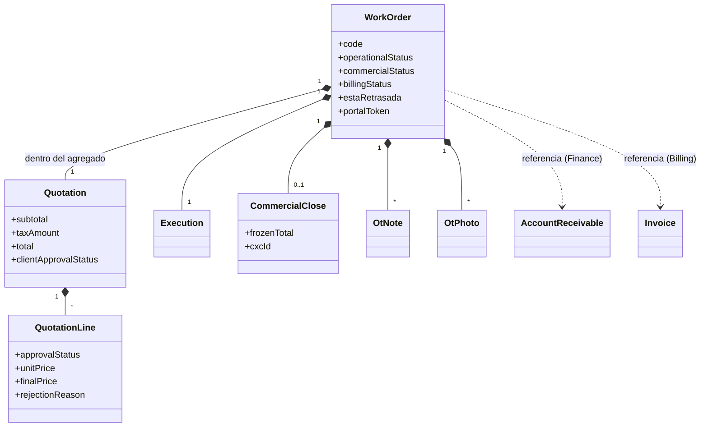
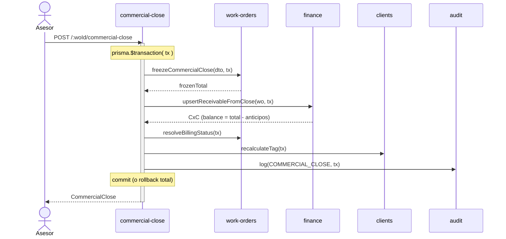
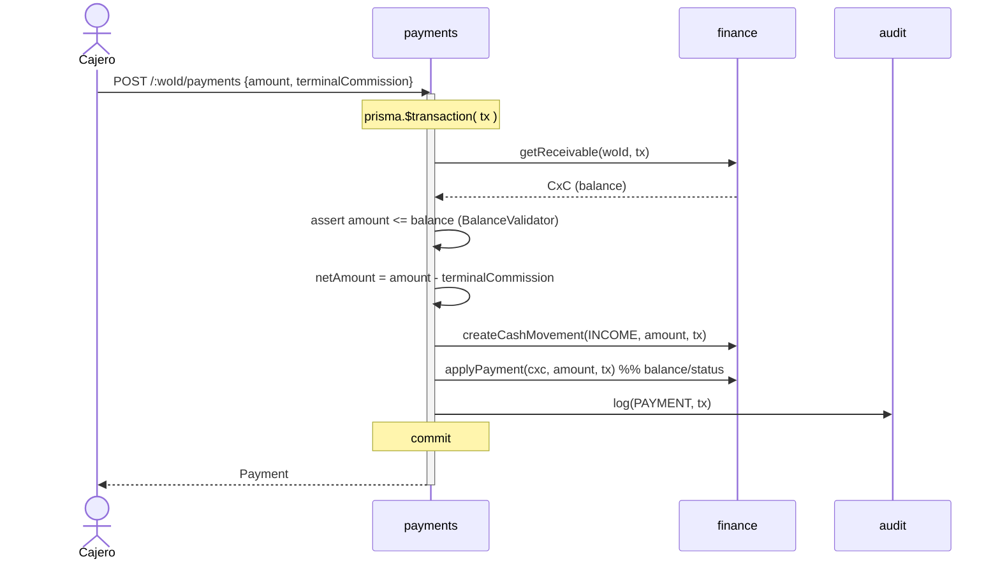

# Diagramas

Todos en Mermaid (texto → se versionan y renderizan en GitHub/Claude Code).

---

## 1. Mapa de bounded contexts

---

## 2. Dependencias entre módulos (acíclico)

Regla anti-circular: `quotations` y `clients` **no** apuntan a `work-orders`.

---

## 3. Agregado Orden de Trabajo

Dentro del agregado (misma transacción): cotización, ejecución, cierre. Fuera (por
`workOrderId`): CxC/pagos/caja, estado fiscal, stock.

---

## 4. Flujo del cierre comercial (una transacción)

---

## 5. Flujo de un pago (anticipo o liquidación)

