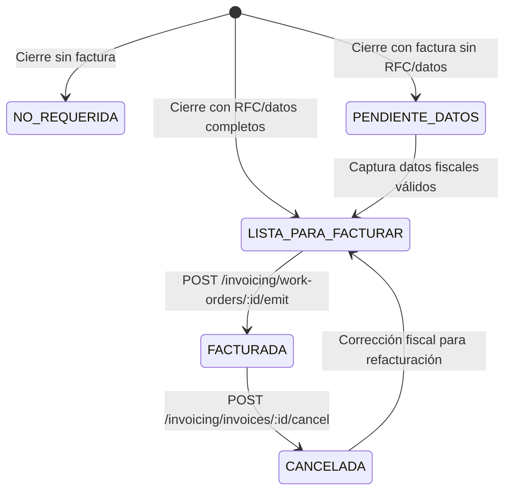

# Módulo: `invoicing` (Facturación Interna)

Dueño de la gestión fiscal interna, validación de datos tributarios según el SAT (México),
emisión de comprobantes internos y bandeja de facturación pendiente. Implementa **ADR-11**
(*Estado fiscal interno; sin timbrado CFDI v1*).

---

## Entidades

- `Invoice`:
  - Llave única de folio por taller: `@@unique([workshopId, invoiceNumber])`.
  - Snapshot fiscal inmutable: `receiverRfc`, `receiverName`, `receiverZipCode`, `receiverTaxRegime`, `cfdiUse`, `paymentMethodSat`.
  - Importes fiscales: `subtotal`, `discountAmount`, `taxAmount`, `total`.
  - Metadatos: `uuid` (UUID v1 simulado), `status` (`ISSUED`, `CANCELLED`), `notes`, `cancellationReason`, `cancelledAt`, `issuedById`, `cancelledById`.
- `InvoiceItem`:
  - Partidas inmutables copiadas de la cotización aprobada (`concept`, `quantity`, `unitPrice`, `subtotal`, `taxAmount`, `total`, `satProductCode`, `satUnitCode`).
- `Client`:
  - Extendido con campos fiscales maestros (`businessName`, `taxRegime`, `zipCode`, `cfdiUse`) para autocompletar órdenes futuras sin re-captura.

---

## Invariantes y Reglas de Negocio

| Regla | Dónde |
|---|---|
| RFC válido mexicano (Física 13, Moral 12, Genéricos SAT) | `FiscalDataValidator.isValidRfc()` (dominio) |
| Código Postal de 5 dígitos numéricos | `FiscalDataValidator.validate()` (dominio) |
| Régimen Fiscal y Uso CFDI válidos según catálogo SAT (CFDI 4.0) | `FiscalDataValidator.validate()` (dominio) |
| Folio consecutivo único por taller (`FAC-0001`, `FAC-0002`...) | `InvoiceNumberGenerator.formatInvoiceNumber()` + query atómica |
| Solo se factura si la OT está en `LISTA_PARA_FACTURAR` | `InvoicingService.emitInvoice()` |
| No se puede duplicar factura activa para una misma OT | `InvoicingService.emitInvoice()` |
| Emisión congela snapshot inmutable de importes y líneas | Transacción en `InvoicingService.emitInvoice()` |
| La emisión transiciona `WorkOrder.billingStatus` a `FACTURADA` | Transacción en `InvoicingService.emitInvoice()` |
| Cancelación requiere motivo descriptivo y clave SAT (`01`-`04`) | `InvoicingService.cancelInvoice()` |
| Cancelar factura transiciona `WorkOrder.billingStatus` a `CANCELADA` | Transacción en `InvoicingService.cancelInvoice()` |
| Todo evento fiscal emite `AuditLog` (`INVOICE_ISSUED`, `INVOICE_CANCELLED`) | `AuditService.log()` en la misma transacción |

---

## Ciclo de Estados de Facturación en la Orden de Trabajo

---

## Endpoints (v1)

### Bandeja de Facturación Pendiente
- `GET /api/v1/invoicing/pending` (requiere `invoice:read`):
  - Retorna la cola de órdenes de trabajo en `PENDIENTE_DATOS` o `LISTA_PARA_FACTURAR`.
  - Diagnostica en tiempo real campos faltantes requeridos por el SAT (`missingFields: ['rfc', 'zipCode', 'taxRegime']`).
  - Filtros: `status`, `search` (por código OT, cliente, RFC, placas), paginación (`page`, `limit`).

### Gestión de Datos Fiscales
- `PUT /api/v1/invoicing/work-orders/:woId/fiscal-data` (requiere `invoice:write`):
  - Valida RFC, razón social, C.P. (5 dígitos), régimen fiscal y uso de CFDI.
  - Actualiza el expediente maestro del cliente (si `applyToClient = true`) y la orden de trabajo.
  - Transiciona automáticamente el estado de la OT a `LISTA_PARA_FACTURAR` si los datos son válidos.

### Emisión de Factura Interna
- `POST /api/v1/invoicing/work-orders/:woId/emit` (requiere `invoice:write`):
  - Genera el siguiente folio secuencial para el taller (`FAC-0001`).
  - Copia las líneas aprobadas de la cotización como `InvoiceItem`s con códigos SAT predeterminados (`78181500`, `E48`).
  - Genera UUID fiscal v1 simulado.
  - Actualiza la orden de trabajo a `FACTURADA`.

### Histórico y Cancelación
- `GET /api/v1/invoicing/invoices` (requiere `invoice:read`):
  - Listado paginado de facturas emitidas y canceladas con filtros por `status`, `search` y fechas (`startDate`, `endDate`).
- `GET /api/v1/invoicing/invoices/:id` (requiere `invoice:read`):
  - Detalle completo de una factura con sus partidas, datos fiscales y auditoría.
- `POST /api/v1/invoicing/invoices/:id/cancel` (requiere `invoice:write`):
  - Cancela una factura emitida con motivo descriptivo y clave SAT.
  - Actualiza el estatus de la OT a `CANCELADA`.
